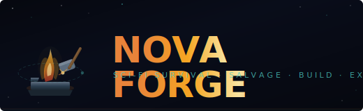
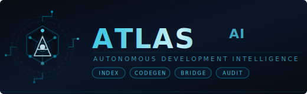
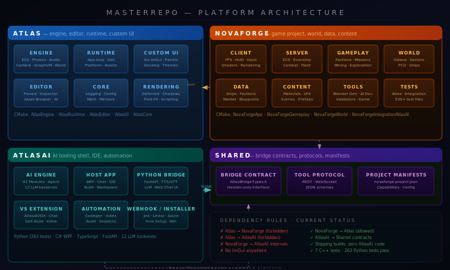

<div align="center">



<br/>



<br/><br/>

[](Tests/)
[](AtlasAI/Tests/)
[](CMakeLists.txt)
[](AtlasAI/HostApp/)
[](LICENSE)

</div>

---

## What Is This?

**MasterRepoRefactor** is a unified, custom-built platform packed into a single monorepo. It is simultaneously:

| Pillar | Description |
|--------|-------------|
| 🎮 **A game engine** (Atlas) | Custom C++ renderer, ECS, physics, audio, input, and UI framework — no ImGui, no Unity, no Unreal |
| 🛠 **A development environment** (Atlas Editor) | Dockable panel IDE, asset browser, diff preview, AI-assisted editing |
| 🤖 **A project-aware AI layer** (AtlasAI) | Workspace indexing, autonomous agents, 41 tool modules, 12 LLM backends |
| 🚀 **A systemic game** (NovaForge) | Low-poly first-person sci-fi survival, salvage, build, and exploration — proof-of-platform |
| 🌐 **A content authoring platform** | PCG ship/station/world generation, procedural faction economy, modding support |

The **flagship game, NovaForge**, is not just a game demo — it is the live proving ground for every system in this platform. Every engine feature, editor tool, and AI capability is validated by running in NovaForge.

---

## Platform Architecture

<div align="center">

</div>

---

## Repository Structure

```
MasterRepoRefactor/
│
├── Atlas/                      ← Engine & editor (no game-specific code)
│   ├── Engine/                 ← ECS, physics, animation, audio, camera, GraphVM, world
│   │   ├── Animation/          ← AnimationGraph, AnimationNodes
│   │   ├── Assets/             ← AssetRegistry, AssetBinary, AssetSerializer
│   │   ├── Audio/              ← AudioEngine
│   │   ├── Camera/             ← Camera, CameraProjectionPolicy
│   │   ├── Core/               ← Engine, EventBus, GameStateManager
│   │   ├── ECS/                ← Entity, System, DeltaEditStore
│   │   ├── GraphVM/            ← Node graph virtual machine
│   │   ├── Input/              ← InputManager, bindings
│   │   ├── Networking/         ← NetManager, packet layer
│   │   ├── Physics/            ← PhysicsWorld
│   │   ├── Plugin/             ← Plugin loader
│   │   ├── Rendering/          ← Deferred, shadows, post-processing
│   │   ├── Scene/              ← SceneGraph, prefabs
│   │   ├── Scripting/          ← Script binding
│   │   ├── Simulation/         ← SimWorld
│   │   └── World/              ← VoxelGrid, CubeSphere layouts
│   │
│   ├── Editor/                 ← Editor framework (no game logic)
│   │   ├── EditorServices/AI/  ← AIAggregator, LocalLLM, TemplateAI backends
│   │   ├── AssetTools/         ← Asset palette, style, batch operations
│   │   ├── Panels/             ← Console, ECS inspector, net inspector
│   │   ├── Framework/          ← Selection, commands, undo/redo
│   │   └── Framework/UI/       ← EditorLayout, menus, keybinds
│   │
│   ├── Core/                   ← Platform utilities (no engine deps)
│   ├── Runtime/                ← App framework, game loop
│   └── UI/                     ← Custom UI framework
│
├── NovaForge/                  ← Game project (builds on Atlas)
│   ├── Client/                 ← C++ game client
│   │   ├── App/                ← HUD, input, presentation
│   │   │   ├── shaders/        ← GLSL vertex/fragment/compute shaders
│   │   │   ├── ui_resources/   ← RmlUI layouts, fonts, styles
│   │   │   ├── assets/         ← Reference models, textures
│   │   │   └── external/       ← Vendored: nlohmann/json, tinygltf, sol2
│   │   └── tests/              ← 20 render/physics/network test programs
│   │
│   ├── Server/                 ← C++ authoritative game server
│   │   ├── App/config/         ← server.json, whitelist.json
│   │   ├── docs/               ← ECS implementation, network docs
│   │   └── tests/              ← 529 gameplay system tests
│   │
│   ├── Gameplay/               ← Factions, combat, economy, missions, PCG
│   ├── World/                  ← Galaxy, sectors, planets, orbital bodies
│   ├── Data/                   ← JSON game data (ships, factions, market, blueprints)
│   ├── Content/                ← Materials, VFX, prefabs, scenes, audio
│   ├── Tools/
│   │   ├── AIDev/              ← Python AI dev toolchain (30+ tools + tests)
│   │   └── GameTools/
│   │       └── BlenderSpaceshipGenerator/  ← 45-module procedural ship generator
│   ├── Tests/AtlasTests/       ← 99 C++ integration tests (AI, editor, gameplay)
│   └── Integrations/AtlasAI/  ← Bridge integration layer
│
├── AtlasAI/                    ← AI tooling shell (no Atlas/NovaForge runtime deps)
│   ├── AIEngine/
│   │   ├── AtlasAIEngine/      ← Python AI core
│   │   │   ├── core/           ← Agent, agentic_agent, self_build, tool_registry
│   │   │   ├── llm/            ← 12 backends: Ollama, llama.cpp, OpenWebUI, Gemini…
│   │   │   └── modules/        ← 41 tool modules (git, filesystem, codegen, CI…)
│   │   └── PythonBridge/       ← FastAPI server (chat, LLM, TTS/STT, build relay)
│   │       └── gui/            ← Embedded ChatGPT-style web interface
│   ├── HostApp/                ← C# WPF host application (.NET 9)
│   │   ├── Build/              ← Build panel + BuildManager
│   │   ├── Chat/               ← Chat UI panel
│   │   ├── Shell/              ← Main shell + docking
│   │   └── Workspace/          ← Session persistence
│   ├── VisualStudioExtension/
│   │   └── AtlasAIVSIX/        ← VS 2022 extension (inline suggestions, chat)
│   ├── Automation/             ← CI automation, workspace tasks
│   ├── Installer/              ← Inno Setup + PowerShell (one-click Windows install)
│   ├── WebhookIntegration/     ← TypeScript bridge: Jira, Azure Boards, Linear
│   └── ProjectAdapters/        ← NovaForge & MasterRepo project adapters
│
├── Shared/                     ← Boundary layer — definitions only, no implementations
│   ├── AtlasBridgeContract/    ← AtlasBridgeTypes.h (header-only interface)
│   ├── ProjectManifests/       ← novaforge.project.json schema
│   └── ToolProtocol/           ← REST/WebSocket spec + JSON schemas
│
├── Docs/                       ← All architecture, design, integration docs
│   ├── Architecture/           ← Monorepo layout, dependency rules, shipping separation
│   ├── Design/                 ← Master design document, missing systems addendum
│   ├── Integration/            ← AtlasAI bridge, tool protocol, project manifest spec
│   ├── Roadmaps/               ← Living roadmap + phase tracking
│   └── images/                 ← SVG logos, architecture diagram, UI mockups
│
├── Services/                   ← Internal service layer (build, editor, simulation)
├── Tests/                      ← Repo-level integration tests
├── Scripts/                    ← Build, lint, CI automation scripts
├── ThirdParty/                 ← Vendored external dependencies
├── Tools/                      ← Repo-wide developer tooling
└── cmake/                      ← CMake modules and target helpers
```

---

## Feature Highlights

### 🎮 NovaForge — The Game

<table>
<tr>
<td width="50%">

**Core Gameplay Loop**
- First-person sci-fi survival / salvage
- Modular ship construction & fitting
- Deep EVE-inspired economy (corporations, contracts, market)
- Mission & exploration systems
- Mining, industrial production, crafting
- PvE/PvP combat with fleet tactics

</td>
<td width="50%">

**World Systems**
- Procedural galaxy, sectors, and planet generation
- Faction standings and diplomacy
- Life support, EVA, ship interiors
- Wormhole navigation & deadspace
- Dynamic asteroid fields
- Day/night & orbital simulation

</td>
</tr>
<tr>
<td>

**Technical Stack**
- C++ authoritative server (**529 test files**)
- C++ game client (**20 test programs**)
- GLSL shaders (deferred, shadows, post-processing)
- External: nlohmann/json, tinygltf, sol2

</td>
<td>

**Content Pipeline**
- Blender procedural ship generator (**45 Python modules**)
- PCG: asteroids, planets, stations, characters
- Atlas exporter for engine-ready assets
- Brick-based modular building system

</td>
</tr>
</table>

---

### ⚙️ Atlas Engine

| System | Details |
|--------|---------|
| **ECS** | Archetype-based entity-component-system with delta edit store |
| **Renderer** | Deferred shading, shadow mapping, post-processing, instanced rendering |
| **Physics** | Custom PhysicsWorld — ship physics, collision, simulation |
| **Audio** | Full AudioEngine — positional, streaming, effects |
| **Animation** | AnimationGraph + AnimationNodes — skeletal + procedural |
| **GraphVM** | Node graph virtual machine for visual scripting |
| **Networking** | Custom net layer — entity sync, lag compensation, interpolation |
| **Custom UI** | No ImGui — entirely custom panel/docking/layout system |

---

### 🤖 AtlasAI — The Tooling Layer

<table>
<tr>
<td width="50%">

**AI Engine (Python)**
- **41 tool modules**: git, filesystem, codegen, CI, audio, blender, cache, database, editor, image, memory, network, pipeline, render, roadmap, scaffold, security, shader, template, test, tile, UI, zip…
- **12 LLM backends**: Ollama, llama.cpp, LM Studio, OpenWebUI, Gemini, Anthropic, TabbyML, LocalAI, CodeGeeX, embedded GGUF…
- Agentic self-build loop
- Session manager, workspace indexer, codegen planner

</td>
<td width="50%">

**Host Application (C# WPF)**
- Dockable chat, build, logs, workspace panels
- Dark-themed custom UI (`.NET 9`)
- Git interface, build manager, updater
- Document viewer, file explorer, notifications

**PythonBridge (FastAPI)**
- Chat, LLM inference, TTS/STT endpoints
- Model downloader (VRAM-aware GGUF recommender)
- Persona system (Arbiter, Coder, Teacher, Organizer)
- Embedded web chat UI

</td>
</tr>
<tr>
<td>

**VS Extension (AtlasAIVSIX)**
- Inline code suggestions
- Embedded chat tool window
- Self-build trigger panel
- Project bridge commands

</td>
<td>

**Integrations**
- **Webhook bridge** (TypeScript): Jira, Azure Boards, Linear
- **Windows installer**: Inno Setup bundles WPF + Python + AIEngine
- **CI/CD**: GitHub Actions publish pipeline for VSIX
- **Project adapters**: NovaForge, MasterRepo legacy adapters

</td>
</tr>
</table>

---

## Build

This project uses **CMake 3.20+**.

```bash
# Configure
cmake -B Build -S .

# Build all targets
cmake --build Build --parallel 4

# Run all tests
ctest --test-dir Build
```

### CMake Targets

| Target | Zone | Description |
|--------|------|-------------|
| `AtlasCore` | Atlas | Core utilities, math, memory |
| `AtlasEngine` | Atlas | ECS, world, rendering, physics, audio |
| `AtlasRuntime` | Atlas | App framework, game loop, simulation |
| `AtlasEditor` | Atlas | Editor framework, panels, AI backends |
| `AtlasUI` | Atlas | Custom UI framework |
| `NovaForgeApp` | NovaForge | Client/server bootstrap |
| `NovaForgeGameplay` | NovaForge | Factions, combat, economy, PCG |
| `NovaForgeWorld` | NovaForge | Galaxy, sectors, planets, ships |
| `NovaForgeIntegrationAtlasAI` | NovaForge | AtlasAI bridge integration layer |
| `AtlasBridgeContract` | Shared | Header-only bridge interface |

### Shipping Build (no tooling / AI code)

```bash
cmake -DMASTERREPO_BUILD_EDITOR=OFF \
      -DNOVAFORGE_ENABLE_ARBITER_INTEGRATION=OFF \
      -DMASTERREPO_BUILD_TOOLS=OFF \
      -B Build -S .
```

### AtlasAI Python Engine

```bash
cd AtlasAI/AIEngine/AtlasAIEngine
pip install -r requirements.txt
python server.py
```

**Tests:**
```bash
python3 -m pytest AtlasAI/Tests/ -v
```

---

## Current Status

| Component | Status | Tests |
|-----------|--------|-------|
| Atlas Engine (C++) | ✅ Building | 7 C++ integration tests passing |
| NovaForge Client (C++) | ✅ Migrated | 20 test programs |
| NovaForge Server (C++) | ✅ Migrated | 529 test files |
| AtlasAI Python Engine | ✅ Active | 263 unit tests passing |
| AtlasAI WPF Host | ✅ Migrated | — |
| AtlasAI PythonBridge | ✅ Migrated | FastAPI + web UI |
| AtlasAI VS Extension | ✅ Migrated | — |
| AtlasAI Installer | ✅ Migrated | Inno Setup script |
| AtlasAI WebhookIntegration | ✅ Migrated | TypeScript + Jest |
| Blender Ship Generator | ✅ Migrated | 45 Python modules |
| Bridge Contracts | ✅ Active | JSON schema validated |
| Architecture Docs | ✅ Complete | 25+ documents |

**Total source files:** ~2,370 C++ · 210 Python · 35 C# · 23 TypeScript

---

## Architecture Laws (Non-Negotiable)

```
✗  No ImGui — all UI is custom
✗  Atlas does not depend on NovaForge
✗  Atlas does not depend on AtlasAI
✗  NovaForge does not depend on AtlasAI internals (bridge contract only)
✗  Shared must stay minimal — defines boundaries, never implements
✗  Shipping builds must contain zero AtlasAI / tooling code
```

See [Docs/Architecture/dependency_rules.md](Docs/Architecture/dependency_rules.md) and [Docs/Architecture/repo_boundaries.md](Docs/Architecture/repo_boundaries.md).

---

## Roadmap

See [Docs/Roadmaps/roadmap.md](Docs/Roadmaps/roadmap.md) for the full living roadmap.

**Completed phases:**
- ✅ Epics 1–10 (monorepo foundation, bridge, refactors, codegen workflow)
- ✅ Zip file migration: all 7 source zips fully integrated
- ✅ PythonBridge, Installer, WebhookIntegration, Engine C++, Editor AI, Server/Client

**Active next goals:**
- 🔄 Engine C++ expansion (Rendering, Scene, Scripting subsystems)
- 🔄 NovaForge Server/Client CMakeLists wiring
- 🔄 Live viewport attachment for AtlasAI
- 🔄 AtlasAI hot-reload / live patch workflow
- 🔄 Full CI pipeline with build + schema + test validation

---

## Documentation

| Document | Description |
|----------|-------------|
| [Master Design Document](Docs/Design/MASTER_DESIGN_DOCUMENT.md) | Full unified vision — all pillars, systems, gameplay, implementation order |
| [Monorepo Layout](Docs/Architecture/monorepo_layout.md) | Folder structure and CMake module targets |
| [Dependency Rules](Docs/Architecture/dependency_rules.md) | Module dependency direction and hard rules |
| [AtlasAI Bridge](Docs/Integration/atlasai_bridge.md) | Transport model, protocol, whitelisted tool actions |
| [Tool Protocol](Docs/Integration/tool_protocol.md) | REST/WebSocket endpoint and event reference |
| [Project Manifest Spec](Docs/Integration/project_manifest_spec.md) | `novaforge.project.json` schema |
| [All Docs Index](Docs/README.md) | Full documentation index |

---

## Contributing

1. Fork the repository
2. Create a feature branch: `git checkout -b feature/your-feature`
3. Read [architecture laws](Docs/Architecture/repo_boundaries.md) before touching cross-zone code
4. Commit with clear messages: `git commit -m 'feat(zone): description'`
5. Open a pull request

---

## License

Open source. See [LICENSE](LICENSE) for details.

<div align="center">
<sub>Built with purpose — a game engine, an IDE, and an AI, all in one repo.</sub>
</div>
